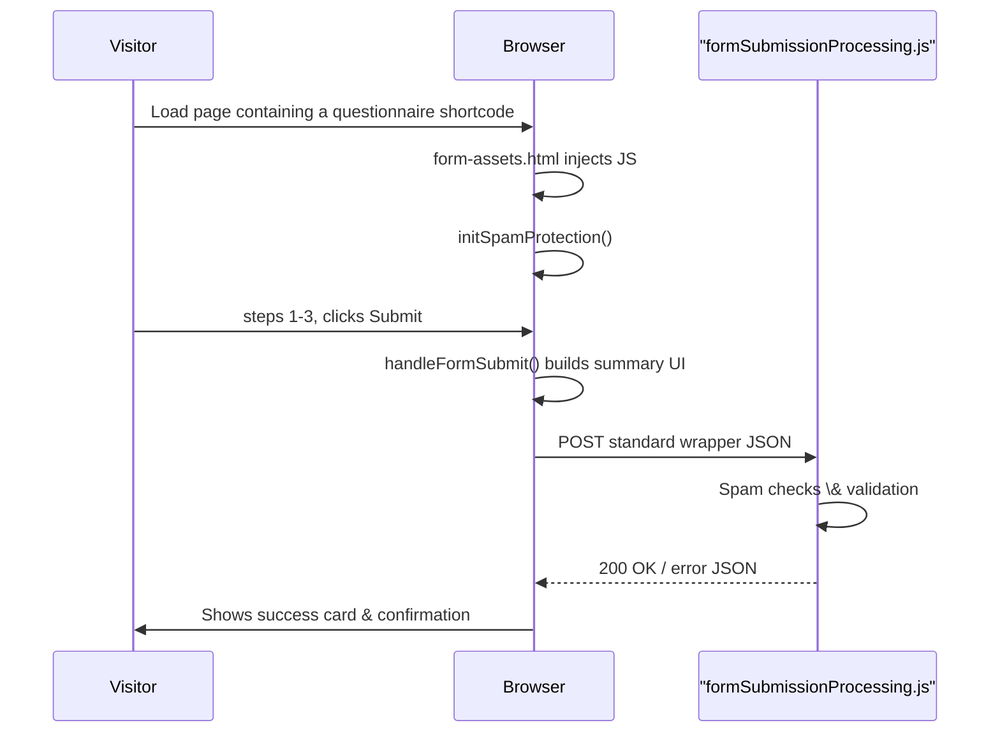

# SwissVital Project — Technical Documentation

*Last consolidated update: **28 Apr 2025***

---

## 1 Project Overview

SwissVital is a diagnostics clinic that complements MRI with modern preventive methods and personalised counselling. Its bilingual (German + English) Hugo website explains services and invites prospective patients to complete **topic‑specific, three‑step questionnaires** that trigger personal consultations.  
**Current milestone:** Full centralisation of form handling, spam protection and confirmation logic. All questionnaires must rely on the new shared script (`form-spam-protection-utils.js`) and serverless backend (`formSubmissionProcessing.js`); legacy per‑form JS and obsolete Netlify functions are being removed.

---

## 2 High‑Level Folder Structure

Directories only, max depth 3 (dot‑prefixed items omitted).

```text
├─ archetypes
├─ assets
│  ├─ css
│  ├─ img
│  └─ translations
├─ content
│  ├─ de
│  └─ en
├─ data
├─ layouts
│  ├─ _default
│  ├─ partials
│  └─ shortcodes
├─ netlify
│  └─ functions
├─ static
│  └─ js
└─ themes
```

*New since April 2025:* `layouts/partials/form-assets.html` (conditional script injection)

---

## 3 Multi‑language Forms

### 3.1 Overview

- 12 shortcodes: `form-{topic}-{lang}.html` (DE + EN)

- Embedded in the matching content pages `content/{lang}/spez_{topic}/20-fragebogen.md`

- No runtime i18n keys inside forms; text is baked in.

### 3.2 Technical Architecture

| Layer           | Highlights                                                                                                                                                                                                        |
| --------------- | ----------------------------------------------------------------------------------------------------------------------------------------------------------------------------------------------------------------- |
| **HTML**        | `<form class="sv-multistep-form">` with three `<section class="sv-form-step">`; hidden inputs: `language`, `form-name`, Netlify honeypot + extra honeypot + spam‑ID + timestamp                                   |
| **CSS**         | `assets/css/sv-styles.css`; custom classes `sv-…`                                                                                                                                                                 |
| **JS (client)** | One shared file `static/js/form-spam-protection-utils.js` (renamed, typo fixed) providing `initSpamProtection()` + `handleFormSubmit()`; optional `form-assets.html` partial injects it only on pages with a form |
| **JS (server)** | Unified Netlify Function `netlify/functions/formSubmissionProcessing.js` (Node 18 + Nodemailer)                                                                                                                   |
| **Validation**  | Browser `required`, customised phone regex, server‑side re‑validation                                                                                                                                             |

### 3.3 File Map (questionnaires only)

```text
project-root/
├── layouts/
│   ├── shortcodes/
│   │   ├── bookingFormMultilanguage.html          — reference form
│   │   ├── form-booking-{de,en}.html             — booking questionnaire
│   │   ├── form-sportler-{de,en}.html            — sports (cleaned 28 Apr 2025)
│   │   ├── form-familiaer-{de,en}.html           — family history
│   │   ├── form-stress-{de,en}.html              — stress
│   │   ├── form-ganzheitlich-{de,en}.html        — holistic
│   │   ├── form-individuell-{de,en}.html         — individual
│   │   └── form-chronisch-{de,en}.html           — chronic
│   └── partials/
│       ├── form-common-fields.html               — shared hidden fields (24 Apr 2025)
│       └── form-assets.html                      — *new* conditional asset loader (28 Apr 2025)
├── static/js/
│   └── form-spam-protection-utils.js             — central spam + submit logic (renamed)
└── netlify/functions/
    └── formSubmissionProcessing.js               — unified backend handler
```

### 3.4 Difficult Issues Solved

| Problem                                                                           | Solution                                                                                                                         | File                                       |
| --------------------------------------------------------------------------------- | -------------------------------------------------------------------------------------------------------------------------------- | ------------------------------------------ |
| Duplicate submission + missing summary (legacy local handler + outdated endpoint) | Removed local `submit` handler and `sendQuestionnaireConfirmation` fetch; `handleFormSubmit()` now builds summary and posts once | `layouts/shortcodes/form-sportler-de.html` |
| Script loaded on pages without forms                                              | `layouts/partials/form-assets.html` injects JS only when a form shortcode is rendered                                            | `layouts/partials/form-assets.html`        |
| Filename typo prevented shared script import                                      | Renamed `form-spam-protectoin-utils.js` → `form-spam-protection-utils.js`                                                        | `static/js/form-spam-protection-utils.js`  |
| Hidden‑field navigation block                                                     | Hidden nodes skipped during step validation                                                                                      | each `form-*-{lang}.html`                  |
| Tooltip overlap with Bootstrap floating labels                                    | Tooltip markup placed outside `.form-floating`                                                                                   | shortcodes                                 |
| Checkbox inconsistencies                                                          | Bootstrap defaults restored                                                                                                      | `assets/css/sv-styles.css`                 |

---

## 4 Form Protection & Validation

- Dual honeypot fields (`bot-field`, `website`)

- Client‑generated `sv_id` and `form_start_time`

- Minimum fill time 2 s

- IP rate limit 5 submissions/hour (in‑memory store)

- Server‑side validation for email, phone, birth‑year, names, required checkboxes, etc.

- Silent 302 redirect on spam to `/danke-anmeldung/`

The full algorithm lives in `form-spam-protection-utils.js` (client) and `formSubmissionProcessing.js` (server).

---

## 5 Technical Stack & Concepts

- **Hugo ≥ 0.115** — static‑site generator

- **Bootstrap 5** — layout & responsive grid

- **Material Icons** — UI icons

- **JavaScript ES6** — client scripting

- **Fetch API** — async submission

- **FormData API** — serialising form entries

- **Netlify Functions (Node 18)** — serverless backend

- **Nodemailer** — email transmission

- **Mermaid** — documentation diagrams

- **Markdown** — content & docs

---

## 6 Build, Run & Deployment

```bash
# 1. Clone & install
npm install          # Bootstrap, icons, mermaid

# 2. Local dev
hugo server -D       # live reload
netlify dev          # emulate functions

# 3. Environment (Netlify UI or netlify.toml)
SMTP_HOST= …
SMTP_PORT=465
SMTP_SECURE=true
SMTP_USER=svc@swissvital.com
SMTP_PASSWORD=********
EMAIL_FROM=forms@swissvital.com

# 4. Production build & deploy
hugo --minify
netlify deploy --prod
```

---

## 7 Next Steps / TODO

- Migrate **all** remaining shortcodes to use `form-assets.html`.

- Remove legacy Netlify Function `sendQuestionnaireConfirmation` if still deployed.

- Implement confirmation email to user inside `formSubmissionProcessing.js`.

- Translate EN placeholders (marked ♦) and finish remaining forms.

- Add Jest/Puppeteer test ensuring summary renders post‑submit.

- Move hero images to Hugo `resources` pipeline for automatic optimisation.

- Consider storing IP rate limits in persistent storage (Redis/Upstash) for multi‑instance deployments.

---

## 8 Process Diagram


