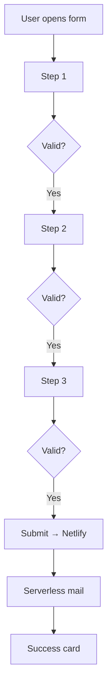

# SwissVital Project — Technical Documentation

## 1 Project Overview

SwissVital is a diagnostics clinic that complements MRI with modern preventive methods and personalised counselling.  
The Hugo-based website is a **full informational presence in German and English**: it explains SwissVital’s philosophy, diagnostic services and locations, then invites readers to engage. As part of that content, each thematic page (e.g. sports injuries, chronic stress) ends with a **topic-specific, three-step questionnaire** that visitors can submit to request a personal consultation about their medical needs.

---

## 2 High-Level Folder Structure

Directories only, max depth 3; dot-prefixed items are omitted.

```text
├─ archetypes
├─ assets
│  ├─ css
│  ├─ img
│  │  ├─ home
│  │  ├─ sections
│  │  ├─ sport
│  │  ├─ standorte
│  │  └─ untersuchungen
│  └─ translations
├─ content
│  ├─ de
│  │  ├─ Untersuchungen
│  │  ├─ geraete
│  │  ├─ home
│  │  ├─ indikationen
│  │  ├─ must-have
│  │  ├─ spez_sportler
│  │  ├─ standorte
│  │  └─ Untersuchungen
│  └─ en
│     ├─ Untersuchungen
│     ├─ geraete
│     ├─ home
│     ├─ indikationen
│     ├─ must-have
│     └─ standorte
├─ data
├─ layouts
│  ├─ _default
│  ├─ … (partials, shortcodes, etc.)
├─ netlify
│  └─ functions
├─ node_modules
├─ public
├─ resources
├─ scripts
├─ static
└─ themes
```

---

## 3 Multi-language Forms

### 3.1 Overview

- **12 shortcodes**: `form-{topic}-de.html` & `form-{topic}-en.html`.

- Each shortcode is embedded at the end of a service page (`content/{lang}/spez_{topic}/20-fragebogen.md`).

- All text is baked in; **no i18n keys inside the forms**.

### 3.2 Technical Architecture

| Layer          | Highlights                                                                                                                                |
| -------------- | ----------------------------------------------------------------------------------------------------------------------------------------- |
| **HTML**       | `<form class="sv-multistep-form">` with three `<section class="sv-form-step">`. Hidden inputs: `language`, `form-name`, Netlify honeypot. |
| **CSS**        | `assets/css/sv-styles.css`; all custom classes prefixed `sv-`.                                                                            |
| **JS**         | Step navigation, custom accordion dropdowns, CH phone formatter, summary builder, fetch to serverless endpoint.                           |
| **Validation** | HTML `required`; custom phone regex; full validation re-enabled before launch.                                                            |

### 3.3 File Map (forms only)

```text
project-root/
├── layouts/
│   └── shortcodes/
│       ├── bookingFormMultilanguage.html          ← reference
│       ├── form-booking-de.html                   ← booking form (DE)
│       ├── form-booking-en.html                   ← booking form (EN)
│       ├── form-sportler-de.html                  ← sports (DE)   ✔
│       ├── form-sportler-en.html                  ← sports (EN)   ✔
│       ├── form-familiaer-de.html                 ← family history (DE) ✔
│       ├── form-familiaer-en.html                 ← family history (EN) ♦
│       ├── form-stress-de.html                    ← stress (DE)   ✔
│       ├── form-stress-en.html                    ← stress (EN)   ♦
│       ├── form-ganzheitlich-de.html              ← holistic (DE) ✔
│       ├── form-ganzheitlich-en.html              ← holistic (EN) ♦
│       ├── form-individuell-de.html               ← individual (DE) ✔
│       ├── form-individuell-en.html               ← individual (EN) ♦
│       ├── form-chronisch-de.html                 ← chronic (DE)  ✔
│       └── form-chronisch-en.html                 ← chronic (EN)  ♦
├── content/
│   ├── de/spez_{topic}/20-fragebogen.md            ← one per topic (DE)
│   └── en/spez_{topic}/20-fragebogen.md            ← one per topic (EN)
├── assets/css/
│   ├── sv-styles.css                               ← all form rules
│   └── root.css                                    ← global variables
└── netlify/functions/
    └── sendQuestionnaireConfirmation.js            ← bilingual e-mail
```

✔ = present ♦ = planned/placeholder

### 3.4 Difficult Issues Solved

| Issue                                     | Fix                                       | Location             |
| ----------------------------------------- | ----------------------------------------- | -------------------- |
| Hidden required inputs blocked navigation | Skip validation on hidden nodes           | JS in shortcodes     |
| Label gaps after dropping i18n            | Hard-coded bilingual labels per shortcode | `form-*-{lang}.html` |
| Tooltip overlap                           | Tooltip markup outside `.form-floating`   | shortcodes           |
| Checkbox inconsistencies                  | Revert to Bootstrap defaults              | `sv-styles.css`      |

### 3.5 Processing Workflow



### 3.6 Next Steps

1. Re-enable full validation and cross-test on devices.

2. Add progress bar.

3. Graceful error handling on Netlify failures.

4. WCAG 2.1 audit.

5. Finalise bilingual e-mail templates.

---

## 4 Technical Stack & General Concepts

| Area               | Tool / Concept                 |
| ------------------ | ------------------------------ |
| Site generator     | **Hugo ≥ 0.115**               |
| UI / layout        | **Bootstrap 5**, CSS Variables |
| Icons              | Google Material                |
| Client JS          | FormData, Fetch API            |
| Submission backend | **Netlify Forms + Functions**  |
| Mail               | `nodemailer` in function       |
| Build pipeline     | Hugo assets, npm               |


