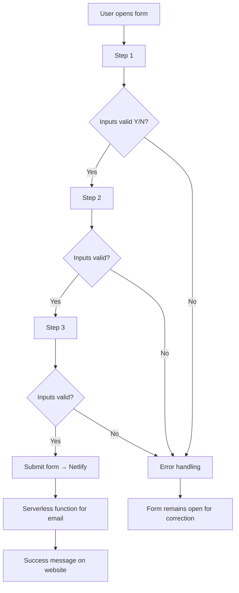
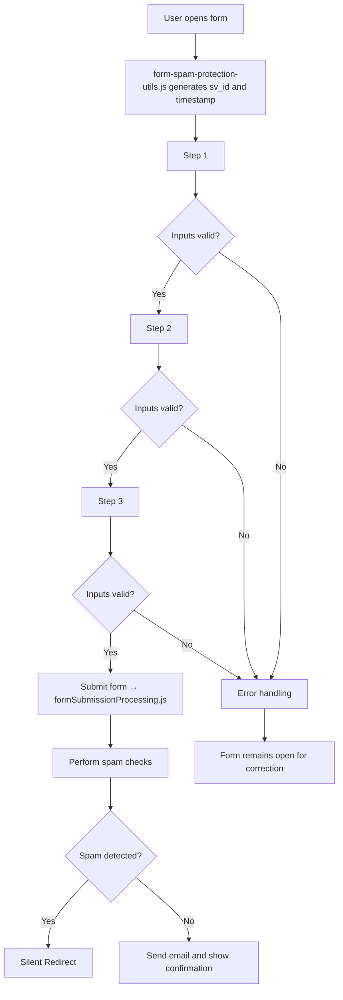

# SwissVital Project — Technical Documentation

## 1 Project Overview

SwissVital is a diagnostics clinic that complements MRI with modern preventive methods and personalised counselling.  
The Hugo-based website is a **full informational presence in German and English**: it explains SwissVital's philosophy, diagnostic services and locations, then invites readers to engage. As part of that content, each thematic page (e.g. sports injuries, chronic stress) ends with a **topic-specific, three-step questionnaire** that visitors can submit to request a personal consultation about their medical needs.

---

## 2 High-Level Folder Structure

Directories only, max depth 3; dot-prefixed items are omitted.

```text
├─ archetypes
├─ assets
│  ├─ css
│  ├─ img
│  │  ├─ home
│  │  ├─ sections
│  │  ├─ sport
│  │  ├─ standorte
│  │  └─ untersuchungen
│  └─ translations
├─ content
│  ├─ de
│  │  ├─ Untersuchungen
│  │  ├─ geraete
│  │  ├─ home
│  │  ├─ indikationen
│  │  ├─ must-have
│  │  ├─ spez_sportler
│  │  ├─ standorte
│  │  └─ Untersuchungen
│  └─ en
│     ├─ Untersuchungen
│     ├─ geraete
│     ├─ home
│     ├─ indikationen
│     ├─ must-have
│     └─ standorte
├─ data
├─ layouts
│  ├─ _default
│  ├─ … (partials, shortcodes, etc.)
├─ netlify
│  └─ functions
├─ node_modules
├─ public
├─ resources
├─ scripts
├─ static
│  └─ js
└─ themes
```

---

## 3 Multi-language Forms

### 3.1 Overview

- **12 shortcodes**: `form-{topic}-de.html` & `form-{topic}-en.html`.

- Each shortcode is embedded at the end of a service page (`content/{lang}/spez_{topic}/20-fragebogen.md`).

- All text is baked in; **no i18n keys inside the forms**.

### 3.2 Technical Architecture

| Layer          | Highlights                                                                                                                                |
| -------------- | ----------------------------------------------------------------------------------------------------------------------------------------- |
| **HTML**       | `<form class="sv-multistep-form">` with three `<section class="sv-form-step">`. Hidden inputs: `language`, `form-name`, Netlify honeypot. |
| **CSS**        | `assets/css/sv-styles.css`; all custom classes prefixed `sv-`.                                                                            |
| **JS**         | Step navigation, custom accordion dropdowns, CH phone formatter, summary builder, fetch to serverless endpoint.                           |
| **Validation** | HTML `required`; custom phone regex; full validation re-enabled before launch.                                                            |

### 3.3 File Map (forms only)

```text
project-root/
├── layouts/
│   ├── shortcodes/
│   │   ├── bookingFormMultilanguage.html          ← reference
│   │   ├── form-booking-de.html                   ← booking form (DE)
│   │   ├── form-booking-en.html                   ← booking form (EN)
│   │   ├── form-sportler-de.html                  ← sports (DE)   ✔ (updated with centralized elements)
│   │   ├── form-sportler-en.html                  ← sports (EN)   ✔
│   │   ├── form-familiaer-de.html                 ← family history (DE) ✔
│   │   ├── form-familiaer-en.html                 ← family history (EN) ♦
│   │   ├── form-stress-de.html                    ← stress (DE)   ✔
│   │   ├── form-stress-en.html                    ← stress (EN)   ♦
│   │   ├── form-ganzheitlich-de.html              ← holistic (DE) ✔
│   │   ├── form-ganzheitlich-en.html              ← holistic (EN) ♦
│   │   ├── form-individuell-de.html               ← individual (DE) ✔
│   │   ├── form-individuell-en.html               ← individual (EN) ♦
│   │   ├── form-chronisch-de.html                 ← chronic (DE)  ✔
│   │   └── form-chronisch-en.html                 ← chronic (EN)  ♦
│   └── partials/
│       └── form-common-fields.html                 ← shared form fields for spam protection ✔
├── content/
│   ├── de/spez_{topic}/20-fragebogen.md            ← one per topic (DE)
│   └── en/spez_{topic}/20-fragebogen.md            ← one per topic (EN)
├── assets/css/
│   ├── sv-styles.css                               ← all form rules
│   └── root.css                                    ← global variables
├── static/js/
│   └── form-spam-protection-utils.js               ← centralized spam protection logic ✔
└── netlify/functions/
    └── formSubmissionProcessing.js                 ← unified form handler for all forms ✔
    ✔ = present ♦ = planned/placeholder
```

### 3.4 Difficult Issues Solved

| Issue                                     | Fix                                       | Location                        |
| ----------------------------------------- | ----------------------------------------- | ------------------------------- |
| Hidden required inputs blocked navigation | Skip validation on hidden nodes           | JS in shortcodes                |
| Label gaps after dropping i18n            | Hard-coded bilingual labels per shortcode | `form-*-{lang}.html`            |
| Tooltip overlap                           | Tooltip markup outside `.form-floating`   | shortcodes                      |
| Checkbox inconsistencies                  | Revert to Bootstrap defaults              | `sv-styles.css`                 |
| Form submission duplication               | Centralized form handler                  | `form-spam-protection-utils.js` |
| Spam protection                           | Multi-layered approach with hidden fields | All forms + Netlify function    |

### 3.5 Processing Workflow




## 4 Form Protection and Validation

### 4.1 Introduction

To ensure the quality of incoming requests on the SwissVital website and effectively prevent automated spam submissions, a multi-layered protection and validation system has been implemented.  
This concept takes into account the special requirements of the SwissVital forms, which represent medical questionnaires and booking forms for various diagnostic and consulting packages.  
The goal is to reliably allow legitimate inquiries, efficiently block spam, and enable flexible, user-friendly input at the same time.

The focus is on:

- Light obfuscation of validation mechanisms to make it harder for bots to access

- Time-based protection measures that detect machine completion

- Meaningful, but not overly strict input validation, adapted to the medical and international context of SwissVital clients

This concept is implemented consistently across all multilingual form variants.

### 4.2 Spam Protection Measures

| Measure                          | Details                                                                            |
| -------------------------------- | ---------------------------------------------------------------------------------- |
| **Honeypot Field** (`bot-field`) | Already present, remains in place.                                                 |
| **Second Honeypot** (`website`)  | Additional invisible field that only bots will fill out.                           |
| **SV-ID**                        | Hidden field with client-side generated unique ID for bot detection.               |
| **Form-Start-Time**              | Timestamp generated when the form loads.                                           |
| **Time-to-Fill Check**           | Form must be submitted at least 2 seconds after start.                             |
| **IP Rate Limiting**             | Maximum 5 submissions per hour from the same IP address.                           |
| **Silent-Block for Spam**        | Invalid requests are redirected (302) to the thank you page without error message. |
| **Centralized Logic**            | Common JavaScript file (`form-spam-protection-utils.js`) for all forms.            |

### 4.3 Input Validation with Server-Side Checks

| Field              | Validation (adjusted)                                                                                    |
| ------------------ | -------------------------------------------------------------------------------------------------------- |
| `email`            | Must be a valid email address (`emailRegex`).                                                            |
| `telefon`          | Relaxed check for basic telephone number structure, no restriction to Switzerland or mobile.             |
| `geburtsjahr`      | Four digits, within the last 110 years calculated from the current date.                                 |
| `vorname/nachname` | Relaxed check: letters, hyphens and special characters allowed. Minimum length 2 characters, maximum 50. |
| `strasse/ort`      | Minimum length 2 characters, maximum 100 characters.                                                     |
| Selection fields   | Required: At least one selection made.                                                                   |
| Checkboxes         | Privacy policy and terms must be checked.                                                                |
| Free text          | Maximum 1000 characters, no `<script>` tags or similar harmful content.                                  |

### 4.4 Centralized Form Processing

To facilitate maintenance and ensure consistent handling of all forms, several aspects of form handling are centralized:

#### 4.4.1 Centralized Components

| Component                       | Description                                                                                           |
| ------------------------------- | ----------------------------------------------------------------------------------------------------- |
| `form-spam-protection-utils.js` | Common JavaScript file for all spam protection functions such as ID generation and timestamp setting. |
| `form-common-fields.html`       | Partial with common hidden fields for all forms.                                                      |
| `formSubmissionProcessing.js`   | Unified Netlify function for processing all form types with form-specific configuration.              |

#### 4.4.2 Standardized Form Schema

All forms use a unified data submission format:

```javascript
{
  type: "sportler-survey",            // Form type for identification
  timestamp: "ISO-timestamp",         // Submission time
  fields: {                           // All form fields
    vorname: "value",
    nachname: "value",
    // etc.
  },
  spamProtection: {                   // Spam protection data
    sv_id: "unique-ID",
    form_start_time: 1645678901234
  }
}
```

#### 4.4.3 Form Type Configuration

The central processing function contains configurations for all form types:

```javascript
const formConfig = {
  'sportler-survey': {
    requiredFields: ['vorname', 'nachname', 'email', 'telefon', 'geschlecht'],
    emailTemplate: 'sportler-email-template',
    recipients: ['sport@example.com']
  },
  'stress-survey': {
    requiredFields: ['vorname', 'nachname', 'email', 'telefon', 'stress_level'],
    emailTemplate: 'stress-email-template',
    recipients: ['stress@example.com']
  }
  // Additional form types
};
```

### 4.5 Technical Process



### 4.6 Advantages of the New Implementation

- **Multi-layered protection** against spam without deteriorating the user experience
- **High data quality** through meaningful validation
- **Lightweight and performant**, without external services
- **Centralized logic** reduces redundancy and simplifies maintenance
- **Configuration-based form processing** enables easy extension
- **Unified error handling** across all forms
- **Better testability** through modular structure
- **Future-proof** through flexible adaptation to form changes

---

## 5 Technical Stack & General Concepts

| Area               | Tool / Concept                 |
| ------------------ | ------------------------------ |
| Site generator     | **Hugo ≥ 0.115**               |
| UI / layout        | **Bootstrap 5**, CSS Variables |
| Icons              | Google Material                |
| Client JS          | FormData, Fetch API            |
| Submission backend | **Netlify Forms + Functions**  |
| Mail               | `nodemailer` in function       |
| Build pipeline     | Hugo assets, npm               |
| Spam protection    | Multi-layer client/server      |
