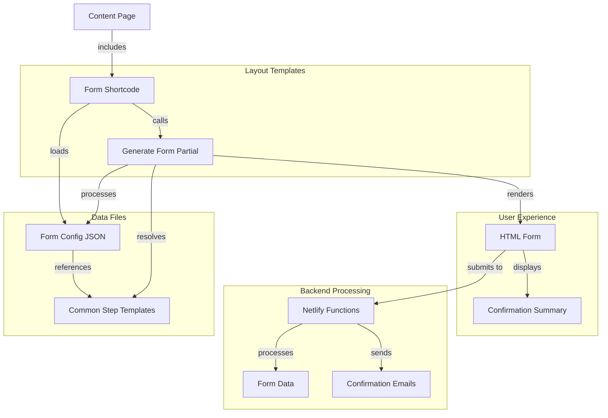

### Exhaustive Integrated Project Summary: SwissVital Modular Form System

### 1 – Project Overview

The project involves upgrading the SwissVital clinic website (a facility specializing in modern diagnostics with MRI focus) by implementing a modular form generation system. The current milestone focuses on creating a configuration-driven approach for questionnaires where common elements (like personal information and contact steps) are reused across different medical questionnaires, while keeping specialized middle sections unique to each form type. This system will replace the current hardcoded implementation of forms with a more maintainable, consistent JSON-based approach.

### 2 – Consolidated Decisions & Insights

- Adopted a modular approach with common steps shared across forms (personal info, contact & submit)
- Decided to use JSON configuration files to define form structure, fields, and validation
- Structured forms as 3-step questionnaires with consistent navigation and validation
- Implemented Bootstrap 5 accordions for grouping related questions
- Made field labels consistently managed for proper display in confirmation windows
- Used Hugo's merge function for dictionary manipulation rather than attempting to use .Set method
- Created a centralized form generator template that can load modular components
- Decided to handle special form types (checkboxes with [] suffix) consistently
- Used a reference-based approach ("common/step_name") for including shared components
- Maintained consistency with existing spam protection and form submission processing
- **TODO**: Verify step one rendering and fix any remaining template issues
- **OPEN QUESTION**: Are there potential issues with Netlify form handling when using the generated forms?
- **OPEN QUESTION**: Should we integrate i18n capabilities for multilingual forms?

### 3 – Implemented Artifacts

```text
/data
├─ /forms
│  ├─ sportler_questionnaire.json           — Sports questionnaire configuration
│  ├─ /common
│     ├─ step_one_personal_info.json        — Reusable personal information step
│     └─ step_three_contact_and_submit.json — Reusable contact & submit step
/layouts
├─ /partials
│  ├─ form-assets.html                      — Central JS utilities for all forms
│  ├─ generate-form.html                    — Form generator template
│  └─ spam-protection-fields.html           — Spam protection partial
├─ /shortcodes
│  ├─ form-sportler-de.html                 — Original hardcoded sports form
│  └─ form-sportler-modular.html            — New modular sports form shortcode
├─ /questionnaires
│  └─ sportler.html                         — Sports questionnaire page template
/netlify/functions
├─ formSubmissionProcessing.js              — Form submission handler
└─ sendConfirmationBilingualFragebogen.js   — Email confirmation sender
/content
└─ /de
   └─ /spez_sportler
      └─ 20-fragebogen.md                   — Content page using the sports form
```

### 4 – Difficult Issues Solved

- **Problem** — Field labels in form confirmations were lowercase or missing
  
  - **Solution** — Fixed the label generation process in form assets, ensuring proper capitalization
  - **File** — layouts/partials/form-assets.html

- **Problem** — Dictionary manipulation in Hugo templates caused an error: "Set is not a method but has arguments"
  
  - **Solution** — Replaced `.Set` method approach with Hugo's `merge` function to create new dictionaries
  - **File** — layouts/partials/generate-form.html

- **Problem** — First step (step_one_personal_info) was not displaying in the generated form
  
  - **Solution** — Added debugging to verify data access and fixed template handling of imported steps
  - **File** — layouts/shortcodes/form-sportler-modular.html

### 5 – Technical Stack & Concepts

- **Hugo (v145)** — Static site generator used for the website
- **Bootstrap 5** — CSS framework for styling and components
- **JSON** — Used for form configuration data
- **Netlify Functions** — Serverless functions for form processing
- **Netlify Forms** — Form submission handling
- **JavaScript** — Client-side form validation and multi-step navigation
- **Hugo Data Files** — For storing form configurations
- **Hugo Partials** — For reusable template components
- **Hugo Shortcodes** — For embedding forms in content pages
- **merge function** — Hugo function to combine dictionaries
- **Accordion Component** — Bootstrap component used for form sections
- **Multi-step Forms** — Forms divided into sequential steps
- **Client-side Validation** — Form validation before submission
- **Form Summary** — Confirmation display after submission
- **Dynamic Label Generation** — Creating field labels from configuration
- **Spam Protection** — Fields and checks to prevent spam submissions

### 6 – Build, Run & Deployment Instructions

1. **Local Development**:
   
   ```bash
   # Start Hugo server
   hugo server
   
   # For clean builds (if caching issues occur)
   hugo server --cleanDestinationDir --disableFastRender
   ```

2. **Directory Structure**:
   
   - Ensure all JSON configuration files are in the correct data directories
   - Verify template files are in the proper layout directories

3. **Form Testing**:
   
   - Access the sports form through its content page
   - Test with local Hugo server (form submissions will only show confirmation in dev mode)
   - For production, Netlify environment variables must be set for SMTP_HOST, SMTP_PORT, SMTP_USER, and SMTP_PASS

4. **Netlify Configuration**:
   
   - Forms must have the `data-netlify="true"` attribute
   - Each form needs a unique name attribute
   - Honeypot field should be present for spam protection

### 7 – Next Steps

- Debug and fix the issue with step one not displaying properly
- Create JSON configurations for other questionnaires (stress, chronic conditions, etc.)
- Implement proper error handling for form validation
- Add comprehensive client-side validation with appropriate error messages
- Enhance accessibility according to WCAG standards
- Test form submissions with the Netlify backend
- Consider implementing i18n support for multilingual forms
- Create proper documentation for the form generation system
- Review all form validations to ensure they match business requirements
- Implement automated tests for form functionality

### 8 – Diagrams


